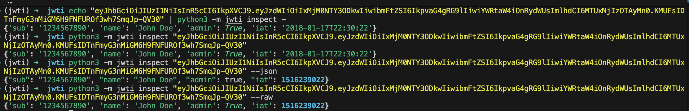

# jwti

*JWTI* is an utility for inspecting JWT tokens.

## Usage



Read from STDIN:

```bash
echo "<JWT>" | python3 -m jwtq inspect -
```

Input argument:

```bash
python3 -m jwtq inspect <JWT>
```

Get help:

```bash
python3 -m jwtq ---help
```
